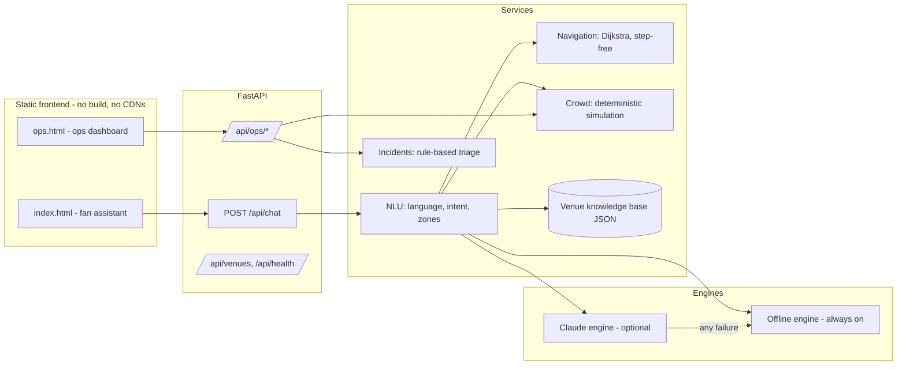

# StadiumIQ — GenAI Matchday Copilot for FIFA World Cup 2026

**Hack2Skill Challenge 4: Smart Stadiums & Tournament Operations**

StadiumIQ is a GenAI-enabled web app that improves the matchday experience at FIFA World Cup 2026 venues from two sides at once:

1. **Fans** get a multilingual smart assistant (English / Español / Français) for in-stadium navigation, step-free accessible routing, facility finding, public transport, live crowd levels, sustainability tips and fixture info.
2. **Venue staff** get an operations dashboard with per-zone crowd intelligence, an AI-written situation brief, rule-based action recommendations, and AI-assisted incident triage.

Everything runs from one small FastAPI app with a dependency-free frontend — and it works **with or without an AI API key** (see [Engines](#the-two-engine-design)).

---

## Chosen vertical

> **Persona: the fan**, served through *multilingual assistance + smart navigation + accessibility*, with a supporting *operational intelligence / real-time decision support* view for venue staff.

Why this combination: the single most common matchday problems (getting to the right gate, finding a restroom/water/first aid, catching the train home, avoiding the crush) are exactly where a context-aware assistant beats static signage — and the same crowd context that helps a fan pick a quieter gate is what an operations team needs to act on. One shared data model powers both personas.

## What it does

| Capability | Example |
|---|---|
| Navigation | "How do I get to Gate C?" → turn-by-turn zones with walking minutes (Dijkstra over the venue graph) |
| Accessibility | "Nearest wheelchair accessible restroom?" → step-free-only routing (elevators/ramps), sensory rooms, access features |
| Multilingual | "¿Dónde está la Puerta A?" — language is auto-detected (en/es/fr) or user-selected; replies follow it |
| Crowd awareness | "How crowded are the gates?" → live per-gate density, plus the assistant proactively suggests the quietest gate inside route answers |
| Transport | Venue-specific rail / bus / parking / rideshare guidance |
| Sustainability | Refill points, zero-waste streams, low-carbon travel nudges |
| Ops: decision support | Per-zone density with trends, prioritized actions ("Redirect arrivals from Gate B to Gate D"), AI situation brief |
| Ops: incident triage | Category + crowd-context scoring → priority + response playbook, in one click |

## Approach and logic

### Ground first, generate second

The core design decision: **the model never free-wheels.** For every message the server

1. **Understands** — sanitises the text, detects language and intent, extracts mentioned zones/facilities (word-boundary keyword NLU in [`app/ai/nlu.py`](app/ai/nlu.py));
2. **Grounds** — computes only the *relevant* facts from structured venue data: a shortest route (with an optional step-free constraint), nearest facilities ranked by walking time, a deterministic crowd snapshot, transport options, the next fixture;
3. **Generates** — hands the message plus that compact JSON grounding to the best available engine, which verbalises it.

This keeps answers factual (the model can't invent a gate), keeps token usage small (no tool-call round trips; context is pre-selected), and makes the whole pipeline unit-testable.

### The two-engine design

| | `claude` engine | `local` engine |
|---|---|---|
| When | `ANTHROPIC_API_KEY` is set | Always available (default) |
| What | Claude (`claude-opus-4-8`) with a frozen, prompt-cached system prompt; natural, conversational, any-language replies | Deterministic trilingual templates over the same grounding |
| Failure mode | Any API error → transparent fallback to `local` | — |

The offline engine is a first-class citizen, not a stub: every feature (routing, accessibility, crowd, triage, all three languages) works without any account, network or key — so the project can be evaluated anywhere, and a production outage of the AI provider degrades the experience instead of breaking it. Each API response reports which engine answered.

### Logical decision making based on user context

- **Match-phase awareness**: crowd densities follow the fixture list — gates spike during ingress/egress, concourses during the match, everything calms in quiet periods.
- **Location awareness**: the fan picks "I am at …" (or it defaults to the transit hub) and every route/facility answer is computed from there.
- **Accessibility awareness**: a "step-free only" toggle *or* accessibility wording in the message ("wheelchair", "sin escaleras"…) switches routing to the step-free edge subgraph and upgrades restroom searches to accessible ones.
- **Crowd-aware advice**: route answers embed a hint when the busiest gate crosses 60% density; ops recommendations escalate (P2→P1) as zones cross high/critical thresholds; incident priority is boosted when the surrounding zone is crowded.

### Architecture



## How to run it

Requires **Python 3.10+**. No database, no build step, no external services.

```bash
# 1. clone & enter
git clone <your-repo-url>
cd <repo>

# 2. install (a virtualenv is recommended)
python -m venv .venv
.venv\Scripts\activate          # Windows   |   source .venv/bin/activate  # macOS/Linux
pip install -r requirements.txt

# 3. run
python run.py
```

Open **http://127.0.0.1:8000** (fan assistant) and **http://127.0.0.1:8000/ops.html** (operations dashboard). Interactive API docs: **/docs**.

**Optional — enable the Claude engine:** copy `.env.example`, set `ANTHROPIC_API_KEY` in your environment, restart. Without it the app runs in offline demo mode; `/api/health` shows which engine is active.

```bash
# Windows (PowerShell)            # macOS / Linux
$env:ANTHROPIC_API_KEY="sk-..."   export ANTHROPIC_API_KEY="sk-..."
```

### Deploy to Vercel

The repo ships with `vercel.json` + `api/index.py`, which re-export the exact same FastAPI app used locally (identical routes, security middleware, and static file serving) as a single serverless function.

```bash
npm i -g vercel     # if you don't have it
vercel               # first deploy - links the project, deploys a preview
vercel --prod        # promote to the production URL
```

Set `ANTHROPIC_API_KEY` (and optionally `STADIUMIQ_MODEL`, `STADIUMIQ_RATE_LIMIT`, `STADIUMIQ_MAX_MESSAGE_LENGTH`) under Project Settings → Environment Variables to enable the Claude engine in production; without it the deployment serves the offline engine, same as local.

**Serverless caveat:** the in-memory rate limiter, crowd-snapshot cache and incident log (see [Assumptions](#assumptions)) are per function instance. On Vercel, concurrent or cold-started invocations may not share that state — e.g. an incident logged on one instance might not appear in a `GET` served by another. This doesn't affect navigation, facilities, crowd levels or chat (all computed fresh per request); it only means the ops incident log isn't guaranteed durable across instances. A production deployment would back it with Redis/a database.

### Run the tests

```bash
pytest
```

**72 tests** cover routing (including a step-free connectivity guarantee for every venue), crowd-simulation determinism and thresholds, incident-triage scoring and priority boundaries, match-phase edges, route origin/destination orientation, cache identity, rate-limiter eviction, NLU (intents, three languages, word-boundary and punctuation edge cases), the full API surface, sanitisation, security headers and prompt-injection behaviour. The suite is deterministic and needs no network or key.

Lint the code the same way CI does:

```bash
pip install -r requirements-dev.txt
ruff check app tests run.py api
```

Every push and PR runs `ruff` + the full `pytest` suite on Python 3.10 / 3.11 / 3.12 via GitHub Actions (`.github/workflows/ci.yml`).

## API overview

| Method & path | Purpose |
|---|---|
| `GET /api/health` | Liveness + active engine |
| `GET /api/venues`, `GET /api/venues/{id}`, `GET /api/venues/{id}/matches` | Venue metadata for the UI |
| `POST /api/chat` | The assistant (message, venue, language, accessibility, location, short history) |
| `GET /api/ops/crowd?venue_id=` | Crowd snapshot + rule recommendations |
| `GET /api/ops/advisory?venue_id=` | Snapshot + recommendations + AI situation brief |
| `POST /api/ops/incidents`, `GET /api/ops/incidents?venue_id=` | Incident triage and log |

## How the evaluation focus areas are addressed

- **Code quality** — layered structure (`api` → `services` → `ai` → `data`), an app factory for isolated test instances, fully type-hinted with modern (3.10+) built-in generics, docstrings that explain *why*, no dead code; **lint-clean under `ruff`** (config in `pyproject.toml`) and enforced in CI on every push.
- **Security** — Pydantic validation with length/pattern constraints on every inbound field; control-character sanitisation before any text reaches a prompt or log; per-IP sliding-window rate limiting (429); security headers incl. a strict same-origin CSP; prompt-injection hardening (user text is delimited data, system prompt frozen; verified by tests); secrets only via environment variables; frontend renders exclusively with `textContent` (no `innerHTML` of untrusted text). The full threat model and control list is in [SECURITY.md](SECURITY.md).
- **Efficiency** — knowledge base loaded once; crowd snapshots cached per 10-minute bucket; grounding pre-computed server-side so Claude needs a single small completion (no tool-loop round trips); the frozen system prompt is marked for Anthropic prompt caching; zero frontend dependencies (whole UI < 40 KB).
- **Testing** — 72 deterministic tests (fixed timestamps, hash-based simulation, offline engine); unit + integration + boundary/adversarial coverage listed above; run in CI across Python 3.10–3.12.
- **Accessibility** — step-free routing is a modelled feature, not an afterthought (tested: every zone in every venue is reachable step-free); UI: semantic landmarks, skip link, labelled controls, `aria-live` chat log and status regions, `lang` attributes on non-English replies, visible focus indicators, WCAG-AA-oriented contrast in light *and* dark themes, `prefers-reduced-motion` respected, fully keyboard-operable.

## Assumptions

1. **Venue layouts, walking times and facilities are illustrative models** of three real 2026 venues (Estadio Azteca, MetLife Stadium, BC Place) — detailed enough to demonstrate the logic, not official maps.
2. **Fixtures are sample data** (see `app/data/matches.json`), aligned so the tournament final at MetLife falls on 2026-07-19 for a realistic live demo.
3. **Crowd densities are a deterministic simulation** standing in for turnstile/sensor feeds. The simulation is isolated in `app/services/crowd.py`; swapping in a real feed changes nothing upstream.
4. **In-memory state is acceptable at demo scale** (rate limiter, incident log, snapshot cache are per-instance and bounded). A production deployment would move these to Redis/a database.
5. **Three languages** (en/es/fr) cover the host countries; the Claude engine additionally answers in whatever language the fan writes.
6. **Safety-critical calls stay rule-based**: incident priorities and crowd thresholds are transparent rules; the GenAI layer explains and briefs but does not decide alone.

## Project structure

```
app/
  ai/           # NLU, prompts, Claude engine, offline engine
  api/          # FastAPI routers + request schemas
  data/         # venue knowledge base + fixtures (JSON)
  services/     # knowledge, navigation, crowd, incidents, assistant orchestration
  config.py     # env-based settings (no secrets in code)
  security.py   # sanitisation, rate limiting, security headers
  main.py       # app factory
static/         # dependency-free frontend (fan assistant + ops dashboard)
tests/          # pytest suite (offline, deterministic)
```

## License

MIT — see [LICENSE](LICENSE).
